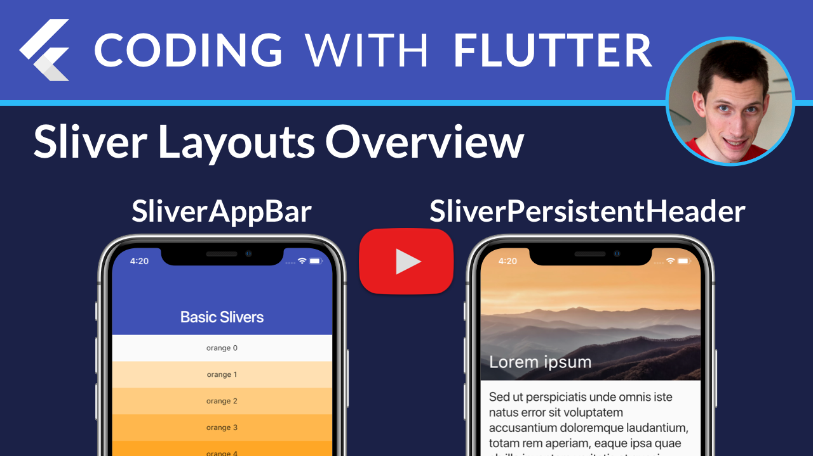

# Example Layouts with Slivers in Flutter

YouTube video walkthrough with explanations here: 

This sample app shows you how to use slivers with some practical examples.

### For more articles and video tutorials, check out [Coding With Flutter](https://codingwithflutter.com/).

### [License: MIT](LICENSE.md)

### Attribution

Youtube Play Icon by [Youtube Clipart](http://clipartmag.com/youtube-clipart).
